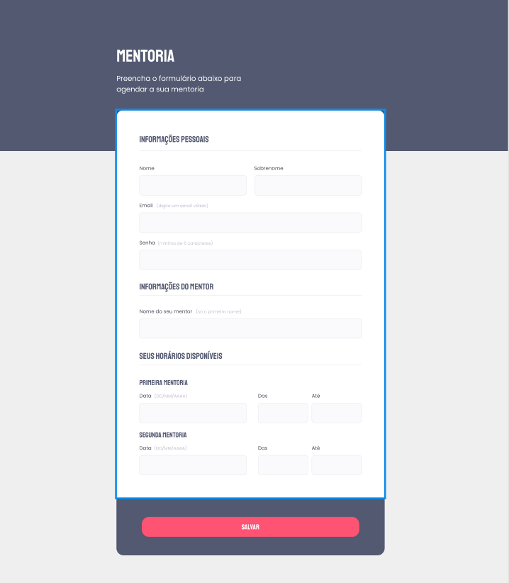

# Projeto 04 - Mentoria ✅

- <a href="">Acesse aqui.</a>

## 💻 O desafio

Nesse desafio, recriei um formulário simples de Mentorias a partir de um layout pronto no Figma para fortalecer alguns conceitos aprendidos nessa aula, entre eles:

- Inputs e labels;
- Fieldset e legend;
- Checkbox customizado;
- Campo select;
- Validar campos e submeter formulários.

## 🎨 Layout do projeto

Este é o <a href="https://www.figma.com/file/Nws1KWB7DyXBw8L6wXb9mp/Stage-03---Formul%C3%A1rio-intermedi%C3%A1rio/duplicate">layout do projeto</a> no Figma.

## 🛠 Tecnologias

    
    

 

 

---

<table>
  <tr>
    <td>
      
    </td>
    <td>
      Feito por <a href="https://github.com/daragneri">Dara Neri</a>
    </td>
  </tr>
</table>
