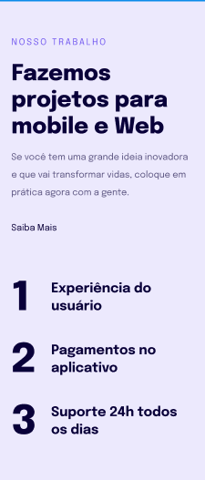

# Projeto 06 - Introdução à Responsividade ✅

- <a href="#">Acesse aqui.</a>

## 💻 O desafio

Nesse desafio, recriei uma página web simples sobre o conteúdo de Responsividade a partir de um layout pronto no Figma para fortalecer alguns conceitos aprendidos nessa aula, entre eles:

- Regra Mobile First;
- Regra das unidades de medidas flexíveis;
- Ajustes de textos;
- Versão Desktop;

## 🎨 Layout do projeto

Este é o <a href="https://www.figma.com/file/UYciB8eFowxCB0BsFnKrvR/Explorer-Stage-03-Projeto-02-(Copy)?type=design&node-id=203-412&t=adG2RXy76Picv1V8-0">layout do projeto</a> no Figma.

## 🛠 Tecnologias

    
    

 

 

---

<table>
  <tr>
    <td>
      
    </td>
    <td>
      Feito por <a href="https://github.com/daragneri">Dara Neri</a>
    </td>
  </tr>
</table>
