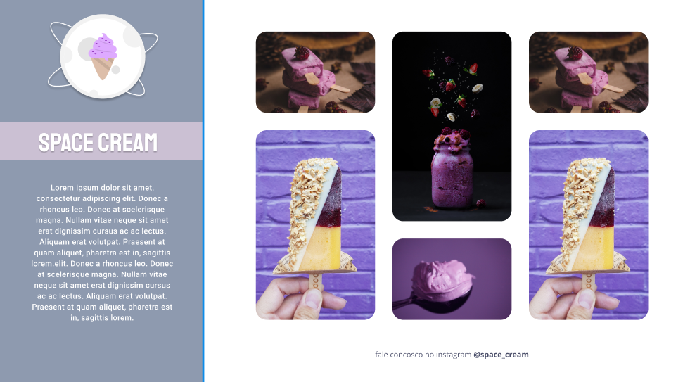
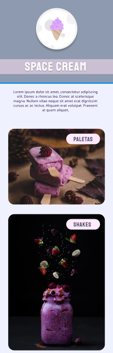

# Projeto 08 - Space Cream ✅

- <a href="#">Acesse aqui.</a>

## 💻 O desafio

Nesse desafio, recriei uma página web simples de uma sorveteria a partir de um layout pronto no Figma para fortalecer alguns conceitos aprendidos nessa aula, entre eles:

- Variáveis e cores HSL no CSS;
- Transições e transformações;
- Animações com CSS;
- Versão Desktop com CSS Grid;
- ADicionando filtros em imagens com CSS;
- Ajustando textos com CSS clamp;
- Mobile First;

## 🎨 Layout do projeto

Este é o <a href="https://www.figma.com/file/3o38HIEsBhgOrPurLRZrHu/Stage-03---Mobile-First-(Copy)?type=design&node-id=0-1&t=Tk466bQMUyYFHgXu-0">layout do projeto</a> no Figma.

## 🛠 Tecnologias

    
    

 

 

---

<table>
  <tr>
    <td>
      
    </td>
    <td>
      Feito por <a href="https://github.com/daragneri">Dara Neri</a>
    </td>
  </tr>
</table>
